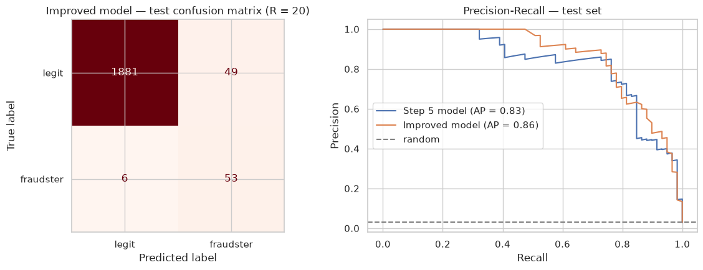
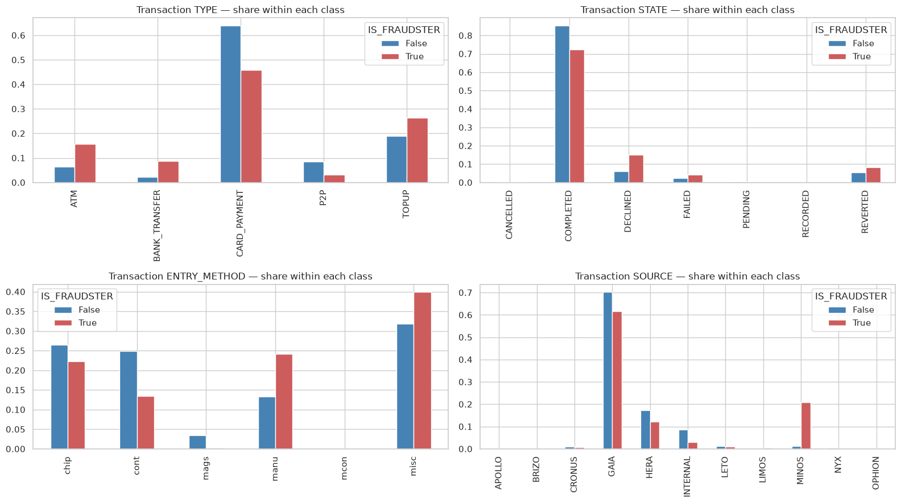
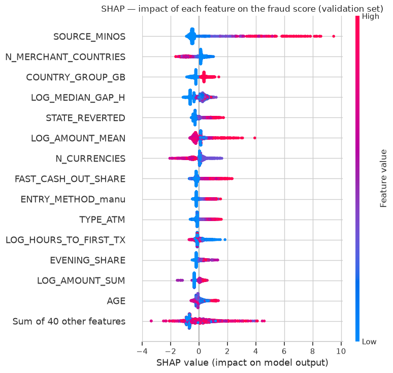

# Fraudster Detection

[](https://github.com/AmidNova/fraudster-detection/actions/workflows/tests.yml)


[](LICENSE)

Spotting fraudulent users of an online bank from their profile and transaction history.
Data science take-home assignment from StrataScratch.

**Result:** a Gradient Boosting model catches **53 of 59 fraudsters** in the test set (recall 0.90), with a PR-AUC of **0.86** where random guessing gives 0.03.

📓 [Read the notebook](fraud_detection.ipynb) (rendered by GitHub, nothing to install)



## What the data says

Fraudsters behave like **money mules**: money comes in and leaves the account fast.

- They top up, then withdraw cash or wire the money out, often within 24 hours.
- They rely heavily on `MINOS`, a small channel (1.6% of all transactions) that only handles top-ups and bank transfers: 21% of fraudsters' transactions vs 1% for other users.
- Their transactions are more often declined, typed in manually and larger.
- They use the account narrowly: few currencies, few countries. Real customers travel.
- Users with no transaction, no email or no KYC almost never commit fraud: they are inactive.



## What the model learned

Each dot is a user; red = high feature value, right = pushes towards "fraudster".
MINOS, fast cash-out after a top-up, large amounts and ATM use push the score up. Many currencies and merchant countries push it down: real customers travel, fraudsters don't.



## Results

| Model | Test PR-AUC | Recall | Precision |
|---|---|---|---|
| Gradient Boosting, base features, F2 threshold | 0.83 | 0.76 | 0.76 |
| + sequence features, calibrated, cost-based threshold | **0.86** | **0.90** | 0.52 |

More realistic estimates:

- **Train on older accounts, test on newer ones:** PR-AUC 0.76
- **Decide after only 30 days of activity:** PR-AUC 0.68

## Approach

The notebook [`fraud_detection.ipynb`](fraud_detection.ipynb) goes through 6 steps:

1. **Data checks.** `STATE` gives the answer away (locked account = fraudster), so it is excluded. Transactions from unlabelled users are dropped.
2. **Exploration.** Fraudsters vs other users, on profile and transactions.
3. **Features.** One row per user: transaction mix, amounts, timing, geography, share of money cashed out.
4. **Modelling.** Stratified 60/20/20 split, 5-fold cross-validation, PR-AUC as the main metric. Logistic Regression, Random Forest and Gradient Boosting compared; Gradient Boosting wins.
5. **Evaluation.** Threshold chosen on validation, feature importance, a model without MINOS to check robustness, analysis of missed fraudsters.
6. **Improvements.** Sequence features (how fast money moves), early detection, time-based split, calibration, cost-based threshold, SHAP explanations, drift monitoring.

The test set is never used to choose anything, only to report results.

## Limitations

- Only 298 fraudsters (about 60 per evaluation set): scores are uncertain by about ±0.05.
- Labels only cover fraudsters who were caught, so the model partly learns past detection rules.
- Key features drift over time: a deployed model needs monitoring and retraining.
- The cost ratio behind the threshold is an assumption, not a business figure.

## Project structure

```
fraud_detection.ipynb    analysis notebook
fraud_detection/
  features.py            user-level features (profile, transaction mix, sequences)
  evaluation.py          alert stats, cost-based threshold, drift (PSI)
tests/                   unit tests (pytest), run on every push by GitHub Actions
assets/                  figures used in this README
```

## Data

| File | Content |
|---|---|
| `users.csv` | 9,944 users: profile, KYC status, target `IS_FRAUDSTER` (3% fraudsters) |
| `transactions.csv` | 688,651 transactions: type, state, amount, entry method, source, merchant |
| `countries.csv`, `currency_details.csv` | Code dictionaries |

The data is **not included**. Put the four CSV files at the root of the project before running the notebook.

## Run it

```bash
python -m venv .venv
source .venv/bin/activate
pip install -r requirements.txt
jupyter notebook fraud_detection.ipynb   # or open it in VS Code
```

Tests:

```bash
pip install -r requirements-dev.txt
pytest
```

Python 3.12+. Results are reproducible (`RANDOM_STATE = 42`).

## Author

Soro Amidou · [MIT License](LICENSE)
